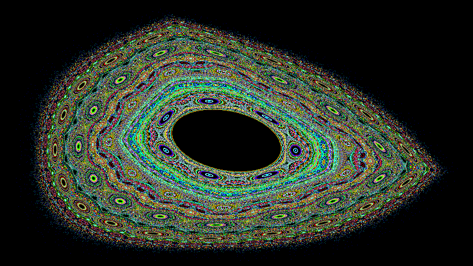

# lozianim
Lozi map fractal image generator, sample image (in file '**image.png**'):

C++ code based on the algorithm found [here](https://galileo-unbound.blog/2018/12/10/the-wonderful-world-of-hamiltonian-maps/). Two coefficients **B** and **C** define look of generated image. Sample image above is generated with `B = -1.0` and `C = 0.5` values. 

Uses [libpng](https://github.com/libpng/libpng/tree/main "libpng") library for saving generated images to PNG files. Requires C++20. Compiled and tested under Windows and Ubuntu (WSL).

The code above generates one image. The program allows to save series of images with animation of **B** and **C** coefficients between values specified in command line. You can also specify a text file with several ranges of coefficients and number of animation steps.

Number of working threads can be specified for faster images generation and saving. Half number of (logical) CPU cores is used by default.

**WARNING**: using all available CPU cores loads CPU about 100%, use with care.

Additions:

- sample 4K video with several animations of coefficients: [https://youtu.be/mQiJQ8mD6QI](https://youtu.be/mQiJQ8mD6QI)
- **anim.txt** file defines coefficient animation used to generate sample video 
- **lozi.html** file contains script for generating one image in browser (coefficients can be changed)
- **win** subfolder contains archive with compiled executable for Windows. 

## Command line
<pre>
Usage: "lozianim.exe" [options]
options can be:
-help			display this help
-width {N}		set output image width in pixels, 1280 by default
-height {N}		set output image height in pixels, 720 by default
-outfolder {path}	set output folder (will be created it doesn't exist) for saving image files
-steps {N}		set number of output images (animation steps), 1 by default
-coef1 {v}		set value (float) of coefficient B, -1.0 by default
-coef2 {v}		set value (float) of coefficient C, 0.5 by default
-coef1end {v}		set ending value (float) of coefficient B, -1.0 by default
-coef2end {v}		set ending value (float) of coefficient C, 1.0 by default
-coefin {file}		get B/C coefficient animation from specified text file
-threads {N}		set number of running threads: use -threads max to use CPU cores number,
use -threads half to use 1/2 CPU cores number (default) or specify a number, e.g. -threads 4
Pressing 'q' stops writing image series.

Every line in coefficient animation text file must consist of:
{steps} {coef1from} {coef1to} {coef2from} {coef2to}

Example (B: -1.0 => -1.0, C: 0.5 => 1.0 in 100 steps):
100 -1.0 -1.0 0.5 1
</pre>
If one image is generated, file name 'image.png' is used, and 'imageNNNNN.png' for image series.
### Examples
<pre>
lozianim.exe -outfolder D:\tmp\png -coef1 -0.9 -coef2 0.5
</pre>
Creates one image 'D:\tmp\png\image.png' with default width and height (1280x720), uses values: `B=-0.9` and `C=0.5`
<pre>
lozianim.exe -outfolder D:\tmp\png -coef1 -1.0 -coef2 0.5 -width 800 -height 450
</pre>
Creates one image 'D:\tmp\png\image.png' with 800x450 width and height, uses values: `B=-1.0` and `C=0.5`

This was used to create sample image in file 'image.png' 
<pre>
fracanim.exe -outfolder D:\tmp\png -steps 1000 -width 1920 -height 1080
</pre>
Creates 1000 images (1920x1080 pixels) in 'D:\tmp\png' folder running on half of available CPU cores. Coefficients are changed in 1000 steps between default values: `B: -1.0`, `C: 0.5 -> 1.0`
<pre>
fracanim.exe -outfolder D:\tmp\png -steps 1000 -width 1920 -height 1080 -coef1 -0.1 -coef1end -1.0 -coef2 0.5 -coef2end 0.5 -threads max
</pre>
Creates 1000 images (1920x1080 pixels) in 'D:\tmp\png' folder running on all available CPU cores (with maximal CPU load). Animates coefficient B from -0.1 to -1.0, coefficient C is set to 0.5.
